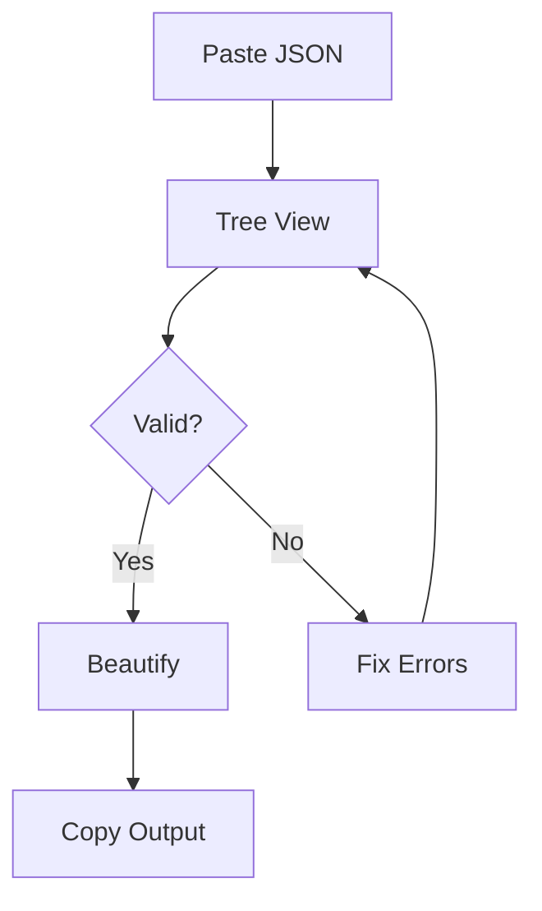

## Overview

JSON Viewer provides a free online tool that helps you view, validate, and beautify JSON data effortlessly. You can paste any JSON string into the interface to explore its structure as an interactive tree, detect syntax errors instantly, and format it for optimal readability. Whether you work with API responses, configuration files, or data exports, this tool streamlines your JSON handling without requiring installations or sign-ups.

<Columns cols={3}>
  <Card title="Interactive Tree View" icon="eye" href="/docs/tree-view">
    Navigate complex nested objects visually.
  </Card>
  <Card title="Real-Time Validation" icon="check-circle" href="/docs/validation">
    Spot errors like missing commas or invalid keys immediately.
  </Card>
  <Card title="One-Click Beautify" icon="sparkles" href="/docs/beautify">
    Transform minified JSON into readable, indented format.
  </Card>
</Columns>

## Key Benefits

You gain several advantages from using JSON Viewer:

- **Speed**: Process large JSON payloads in seconds without local tools.
- **Accuracy**: Automatic validation catches subtle errors before they cause issues in your code.
- **Accessibility**: Works in any modern browser on desktop or mobile.
- **Privacy**: Your data stays in your browser—no servers involved.

<Callout kind="tip">
  Bookmark jsonviewer.ai for quick access during development sprints.
</Callout>

## Basic Workflow

Follow these steps to get started with JSON Viewer:

<Steps>
  <Step title="Paste Your JSON" icon="clipboard">
    Copy a JSON string from your API response, log, or file and paste it into the input field.
  </Step>
  <Step title="Explore the Tree" icon="git-branch">
    The tool renders an expandable tree view. Click nodes to drill down into nested structures.
  </Step>
  <Step title="Validate Syntax" icon="shield-check">
    Review the validation status. Fix errors highlighted in red, such as mismatched braces `{` or brackets `[`.
  </Step>
  <Step title="Beautify and Copy" icon="copy">
    Click the beautify button to format the JSON, then copy the result for use in docs or configs.
  </Step>
</Steps>

## Example: Minified to Beautified JSON

See how JSON Viewer transforms compact data. Use the tabs below to compare inputs and outputs.

<Tabs>
  <Tab title="Raw Input" icon="code">
```json
{"user":{"id":123,"name":"John Doe","email":"john@example.com","orders":[{"id":1,"item":"Laptop","price":999},{"id":2,"item":"Mouse","price":25}],"active":true}}
```
  </Tab>
  <Tab title="Beautified Output" icon="sparkles">
```json
{
  "user": {
    "id": 123,
    "name": "John Doe",
    "email": "john@example.com",
    "orders": [
      {
        "id": 1,
        "item": "Laptop",
        "price": 999
      },
      {
        "id": 2,
        "item": "Mouse",
        "price": 25
      }
    ],
    "active": true
  }
}
```
  </Tab>
</Tabs>

<CodeGroup tabs="JavaScript,Python">
```javascript
// Parse and validate in JS
const jsonString = '{"user":{"id":123}}';
const data = JSON.parse(jsonString);
console.log(data.user.name); // "John Doe"
```
```python
# Parse and validate in Python
import json
json_string = '{"user":{"id":123}}'
data = json.loads(json_string)
print(data['user']['name'])  # John Doe
```
</CodeGroup>

## Common Workflows

<ExpandableGroup>
  <Expandable title="Debugging API Responses" default-open="true">
    Paste raw API output to identify `null` values or unexpected arrays. The tree view reveals hidden issues like extra properties.
  </Expandable>
  <Expandable title="Generating Documentation">
    Beautify JSON schemas and copy them into README files or API specs for clear examples.
  </Expandable>
</ExpandableGroup>



This workflow ensures you handle JSON efficiently every time. JSON Viewer eliminates friction in your daily development tasks.