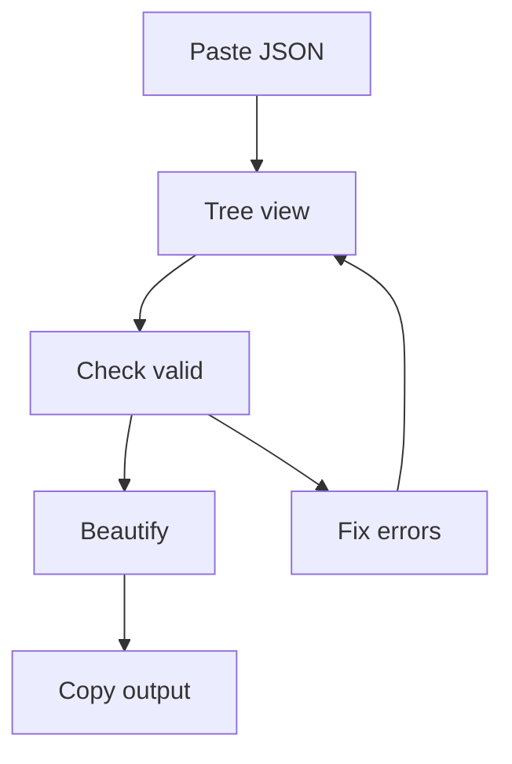

## Overview

JSON Viewer (jsonviewer.ai) is a free, browser-based tool that helps you view, validate, and beautify JSON data effortlessly. You can paste or upload JSON into the interface to explore its structure as an interactive tree, check it for syntax errors, and format it for optimal readability. Whether you work with API responses, configuration files, logs, or data exports, this tool streamlines your JSON handling without requiring installations or sign-ups.

<Columns cols={3}>
  <Card title="Interactive tree view" icon="eye" href="/guide#viewing-and-navigating-json-structures">
  
    Navigate complex nested data visually, expanding and collapsing sections as needed.
  
  </Card>
  <Card title="Real-time validation" icon="check-circle" href="/guide#validating-json-for-errors">
  
    Spot issues like missing commas or invalid values as soon as you paste your JSON.
  
  </Card>
  <Card title="One-click beautify" icon="sparkles" href="/guide#beautifying-and-formatting-json">
  
    Turn compressed JSON into a clean, indented format that is easy to read and share.
  
  </Card>
</Columns>

## Key benefits

You gain several advantages from using JSON Viewer:

- **Speed**: Process large JSON data sets in seconds without installing local tools.
- **Accuracy**: Automatic validation catches subtle errors before they cause issues in your application or report.
- **Accessibility**: Works in any modern browser on desktop or mobile.
- **Privacy**: Your data stays in your browser; it is not sent to any server.

<Callout kind="tip">
  
  Bookmark `jsonviewer.ai` for quick access during development, testing, or analysis sessions.
  
</Callout>

## Use cases

JSON Viewer is helpful in many day-to-day situations, for both technical and non-technical users.

- **Debugging API responses**  
  An API is a way for different software systems to talk to each other. When an API returns JSON, you can paste the response into JSON Viewer to see a clear tree view, highlight problems, and understand what data is available.

- **Checking configuration files**  
  Many apps and services store settings in JSON files. Use JSON Viewer to quickly confirm that the structure is valid and that important options are set as expected.

- **Reviewing logs and exports**  
  Logs, analytics exports, and data snapshots often come as raw JSON. The tree view makes it easier to scan for specific users, events, or fields without reading a long, single-line file.

- **Preparing documentation and reports**  
  Beautify JSON examples for product docs, tickets, specs, or knowledge base articles. Nicely formatted JSON is easier for teammates to read and comment on.

- **Learning and teaching JSON**  
  If you are new to JSON, the tool helps you see how objects, arrays, and values fit together. You can experiment safely and immediately see where syntax errors occur.

## Basic workflow

Follow these steps to get started with JSON Viewer:

<Steps>
  <Step title="Paste your JSON" icon="clipboard">
  
    Copy JSON from an API response, log, file, or export and paste it into the input area. You can also type directly if you are experimenting or learning.
  
  </Step>
  <Step title="Explore the tree" icon="git-branch">
  
    The tool renders an expandable tree view of your data. Click the arrows next to items to drill down into nested structures like lists and nested objects.
  
  </Step>
  <Step title="Validate syntax" icon="shield">
  
    Check the validation status. Errors are highlighted so you can see issues such as mismatched braces, missing commas, or incorrect quotation marks.
  
  </Step>
  <Step title="Beautify and copy" icon="copy">
  
    Click the beautify button to format the JSON into a clean, indented layout. Then copy the result to use in documentation, tickets, or configuration files.
  
  </Step>
</Steps>

## Example: minified to beautified JSON

See how JSON Viewer transforms compact data. Use the tabs below to compare inputs and outputs.

<Tabs>
  <Tab title="Raw input" icon="code">
  
```json
{"user":{"id":123,"name":"John Doe","email":"john@example.com","orders":[{"id":1,"item":"Laptop","price":999},{"id":2,"item":"Mouse","price":25}],"active":true}}
```
  
  </Tab>
  <Tab title="Beautified output" icon="sparkles">
  
```json
{
  "user": {
    "id": 123,
    "name": "John Doe",
    "email": "john@example.com",
    "orders": [
      {
        "id": 1,
        "item": "Laptop",
        "price": 999
      },
      {
        "id": 2,
        "item": "Mouse",
        "price": 25
      }
    ],
    "active": true
  }
}
```
  
  </Tab>
</Tabs>

<CodeGroup tabs="JavaScript,Python">
```javascript
// Parse JSON in JavaScript
const jsonString = '{"user":{"id":123,"name":"John Doe"}}';
const data = JSON.parse(jsonString);
console.log(data.user.name); // "John Doe"
```
```python
# Parse JSON in Python
import json

json_string = '{"user":{"id":123,"name":"John Doe"}}'
data = json.loads(json_string)
print(data["user"]["name"])  # John Doe
```
</CodeGroup>

## Common workflows

<ExpandableGroup>
  <Expandable title="Debugging API responses" default-open="true">
  
    Paste raw API output to identify unexpected `null` values, missing fields, or extra properties. The tree view reveals issues that are hard to see in a single-line JSON string.
  
  </Expandable>
  <Expandable title="Generating documentation">
  
    Beautify JSON examples and copy them into README files, tickets, product specs, or API documentation. Clean formatting makes it easier for teammates and stakeholders to understand the data.
  
  </Expandable>
  <Expandable title="Comparing two versions of JSON">
  
    Open two browser tabs with JSON Viewer and paste a different version of the JSON into each. Use the tree view to quickly scan for added, removed, or changed fields.
  
  </Expandable>
</ExpandableGroup>

<Callout kind="info">
  
  **Limitations (high level)**  
  JSON Viewer runs entirely in your browser and is read-only: it does not change your original files. Very large JSON files may load more slowly or feel less responsive. For more details on limits, performance, and privacy, see the [FAQ](/faq).
  
</Callout>



This workflow helps you handle JSON efficiently every time, from quick checks to detailed reviews.

## Where to go next

- Read the [Quick Start](/quickstart) for a short, hands-on walkthrough.
- Explore the [User Guide](/guide) for detailed instructions on all features.
- Visit the [FAQ](/faq) for troubleshooting, privacy details, and more information about limitations.